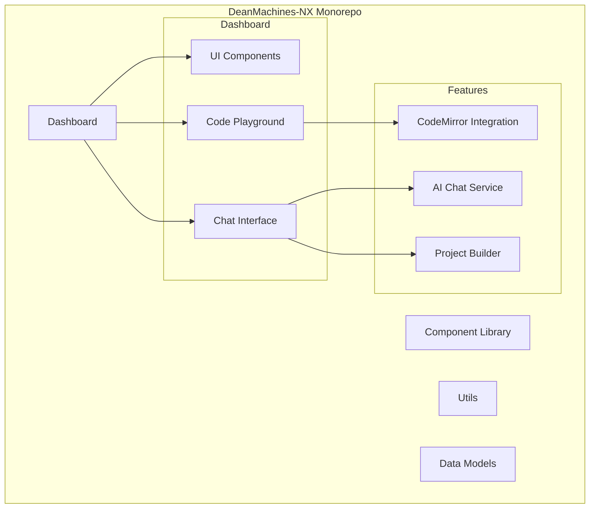
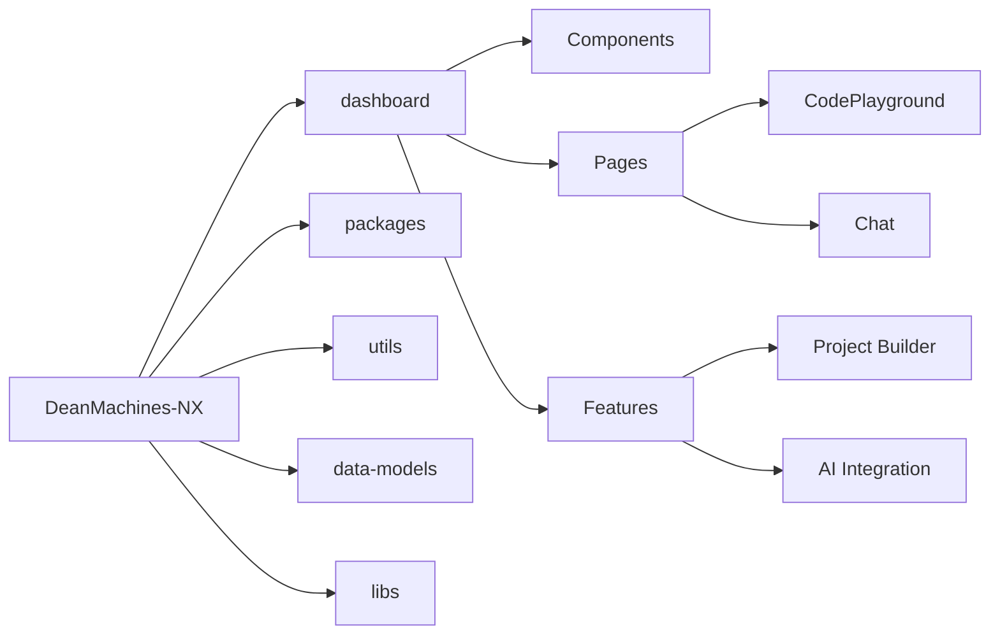
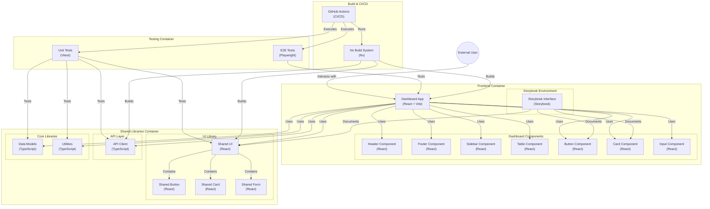

# DeanMachines-NX Project Documentation

## Project Architecture



## Project Structure



## ✅ Completed Infrastructure

### Infrastructure Setup

- [x] Nx monorepo configuration
- [x] Project structure and architecture
- [x] Base development environment
- [x] Initial package dependencies
- [x] Vite build system integration

### Development Environment

- [x] Storybook 8.4.6 setup and configuration
- [x] Testing infrastructure (Vitest + Testing Library)
- [x] E2E testing capability with Playwright
- [x] Basic component development workflow
- [x] Hot reload configuration

### Components

- [x] Button component
  - [x] Implementation
  - [x] Unit tests
  - [x] Storybook documentation
  - [x] Accessibility testing

## 🚀 Current Sprint Focus

### 1. Core Component Library (High Priority)

- [ ] Design system fundamentals
  - [ ] Typography system
  - [ ] Color palette
  - [ ] Spacing system
  - [ ] Grid layout
- [ ] Basic components
  - [ ] Text Input
  - [ ] Select
  - [ ] Checkbox
  - [ ] Radio
  - [ ] Card
  - [ ] Modal
- [ ] Navigation components
  - [ ] Navbar
  - [ ] Sidebar
  - [ ] Breadcrumbs
  - [ ] Tabs

### 2. Developer Experience

- [ ] Component generation templates
- [ ] Documentation structure
- [ ] Coding standards document
- [ ] PR templates
- [ ] Git workflow documentation

## 📋 Upcoming Tasks

### Testing & Quality

- [ ] Unit test templates
- [ ] E2E test templates
- [ ] Visual regression testing (Chromatic)
- [ ] Test coverage targets
- [ ] Performance testing setup

### CI/CD Pipeline

- [ ] GitHub Actions workflow
- [ ] Automated testing
- [ ] Storybook deployment
- [ ] Version management
- [ ] Release automation

### Documentation

- [ ] Component API documentation
- [ ] Usage examples
- [ ] Best practices guide
- [ ] Contributing guidelines
- [ ] Architecture documentation

## 📊 Metrics & Goals

### Quality Targets

- [ ] Test coverage: >80%
- [ ] Zero critical bugs
- [ ] WCAG 2.1 AA compliance
- [ ] Bundle size optimization
- [ ] Build time <2 minutes

### Performance Targets

- [ ] Lighthouse score >90
- [ ] First contentful paint <2s
- [ ] Time to interactive <3s
- [ ] Bundle size <100KB (core)

## 🔄 Weekly Review Items

- Code review metrics
- Test coverage reports
- Performance benchmarks
- Documentation updates
- Dependency updates

## 📅 Timeline

- Sprint Duration: 2 weeks
- Current Sprint: Component Library Development
- Next Review: [Date TBD]

## 🎯 New Requirements

### Interactive Code Playground

- [ ] CodeMirror Integration
  - [ ] Syntax highlighting
  - [ ] Auto-completion
  - [ ] Multiple language support
  - [ ] Code formatting
  - [ ] Theme support

### AI-Powered Chat Interface

- [ ] Chat Component Development
  - [ ] Message threading
  - [ ] Code snippet support
  - [ ] Markdown rendering
  - [ ] Real-time updates
- [ ] AI Integration
  - [ ] Project analysis
  - [ ] Code generation
  - [ ] Context awareness
  - [ ] History management

### Project Builder Integration

- [ ] Project Templates
- [ ] Build Configuration
- [ ] Package Management
- [ ] Development Server
- [ ] Hot Reload Support

## 📦 Dependencies to Add

```json
{
  "dependencies": {
    "@codemirror/basic-setup": "^6.0.0",
    "@codemirror/lang-javascript": "^6.0.0",
    "@codemirror/theme-one-dark": "^6.0.0",
    "socket.io-client": "^4.7.0",
    "marked": "^9.0.0",
    "prismjs": "^1.29.0"
  }
}
```

## 🚀 Implementation Plan

### Phase 1: Code Playground

1. Set up CodeMirror component
2. Implement language support
3. Add theme switching
4. Create code execution environment

### Phase 2: Chat Interface

1. Develop chat UI components
2. Implement WebSocket connection
3. Add message handling
4. Integrate AI capabilities

### Phase 3: Project Builder

1. Create project templates
2. Implement build system
3. Add package management
4. Set up development workflow

## 📊 Success Metrics

### Quality Targets 2

- [ ] Test coverage: >80%
- [ ] Zero critical bugs
- [ ] WCAG 2.1 AA compliance
- [ ] Bundle size optimization
- [ ] Build time <2 minutes

### Performance Targets 2

- [ ] Lighthouse score >90
- [ ] First contentful paint <2s
- [ ] Time to interactive <3s
- [ ] Bundle size <100KB (core)

## 🔄 Sprint Schedule

- Current Sprint (2 weeks): Code Playground Setup
- Next Sprint (2 weeks): Chat Interface Development
- Future Sprint (2 weeks): Project Builder Integration

## 🎯 Immediate Focus

1. CodeMirror setup in Storybook
2. Basic chat interface components
3. WebSocket implementation
4. AI service integration

---
Last Updated: [Current Date]


