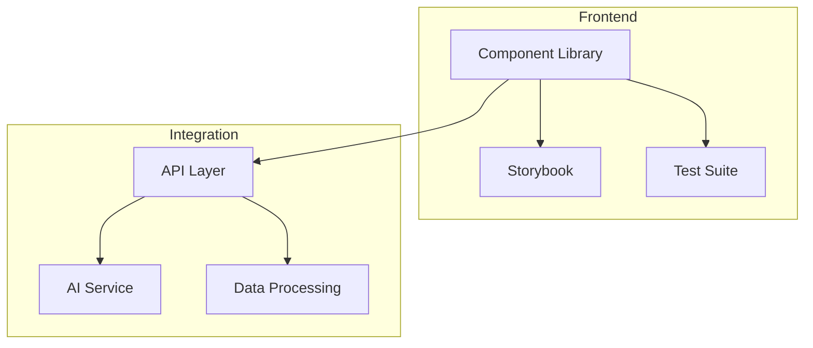
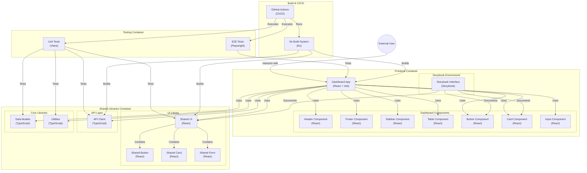

# DeanMachines-NX

> A modern development environment for building scalable React applications with integrated AI assistance

[](https://nx.dev)
[](https://reactjs.org)
[](https://www.typescriptlang.org)
[](https://storybook.js.org)
[](https://vitest.dev)
[](https://pnpm.io)

## 🚀 Project Overview

DeanMachines-NX is a next-generation development environment that combines the power of React components with AI-assisted coding. Built on the Nx monorepo architecture, it provides a seamless development experience with integrated tools for component development, testing, and documentation.

## 📊 Project Progress

````mermaid
gantt
    title Project Development Timeline
    dateFormat  YYYY-MM-DD
    section Infrastructure
    Base Setup           :done, inf1, 2024-01-01, 10d
    Component Library    :done, inf2, after inf1, 14d
    Testing Framework   :done, inf3, after inf2, 7d

    section Components
    Basic Components    :done, comp1, after inf3, 14d
    Advanced Components :active, comp2, after comp1, 21d
    Chat Interface     :comp3, after comp2, 14d

    section Integration
    AI Integration     :int1, after comp2, 21d
    API Layer         :int2, after int1, 14d
    Data Processing   :int3, after int2, 14d
```

## 🎯 Current Progress

| Area | Progress | Status |
|------|----------|---------|
| Infrastructure Setup | 100% | ✅ Complete |
| Component Library | 75% | 🚧 In Progress |
| Testing Framework | 100% | ✅ Complete |
| Storybook Integration | 90% | 🚧 In Progress |
| AI Integration | 0% | 📅 Planned |
| Data Processing | 0% | 📅 Planned |

## 🛠️ Core Features

- **Component Library**
  - Fully typed React components
  - CSS Module styling
  - Accessibility-first design
  - Comprehensive testing

- **Development Tools**
  - Storybook 8.4 for component development
  - Vitest for unit testing
  - Playwright for E2E testing
  - ESLint + Prettier configuration

- **AI Integration** (Coming Soon)
  - Code generation assistance
  - Component suggestions
  - Real-time code analysis
  - Context-aware completions

## 🏗️ Architecture



## Finish your CI setup

[Click here to finish setting up your workspace!](https://cloud.nx.app/connect/ozqXSe9cod)


## Run tasks

To run the dev server for your app, use:

```sh
npx nx serve dashboard
```

To create a production bundle:

```sh
npx nx build dashboard
```

To see all available targets to run for a project, run:

```sh
npx nx show project dashboard
```

These targets are either [inferred automatically](https://nx.dev/concepts/inferred-tasks?utm_source=nx_project&utm_medium=readme&utm_campaign=nx_projects) or defined in the `project.json` or `package.json` files.

[More about running tasks in the docs &raquo;](https://nx.dev/features/run-tasks?utm_source=nx_project&utm_medium=readme&utm_campaign=nx_projects)

## Versioning and releasing

To version and release the library use

```
npx nx release
```

Pass `--dry-run` to see what would happen without actually releasing the library.

[Learn more about Nx release &raquo;](hhttps://nx.dev/features/manage-releases?utm_source=nx_project&utm_medium=readme&utm_campaign=nx_projects)

## Keep TypeScript project references up to date

Nx automatically updates TypeScript [project references](https://www.typescriptlang.org/docs/handbook/project-references.html) in `tsconfig.json` files to ensure they remain accurate based on your project dependencies (`import` or `require` statements). This sync is automatically done when running tasks such as `build` or `typecheck`, which require updated references to function correctly.

To manually trigger the process to sync the project graph dependencies information to the TypeScript project references, run the following command:

```sh
npx nx sync
```

You can enforce that the TypeScript project references are always in the correct state when running in CI by adding a step to your CI job configuration that runs the following command:

```sh
npx nx sync:check
```

[Learn more about nx sync](https://nx.dev/reference/nx-commands#sync)


[Learn more about Nx on CI](https://nx.dev/ci/intro/ci-with-nx#ready-get-started-with-your-provider?utm_source=nx_project&utm_medium=readme&utm_campaign=nx_projects)

## Install Nx Console

Nx Console is an editor extension that enriches your developer experience. It lets you run tasks, generate code, and improves code autocompletion in your IDE. It is available for VSCode and IntelliJ.

[Install Nx Console &raquo;](https://nx.dev/getting-started/editor-setup?utm_source=nx_project&utm_medium=readme&utm_campaign=nx_projects)

## Useful links

Learn more:

- [Learn more about this workspace setup](https://nx.dev/nx-api/js?utm_source=nx_project&amp;utm_medium=readme&amp;utm_campaign=nx_projects)
- [Learn about Nx on CI](https://nx.dev/ci/intro/ci-with-nx?utm_source=nx_project&utm_medium=readme&utm_campaign=nx_projects)
- [Releasing Packages with Nx release](https://nx.dev/features/manage-releases?utm_source=nx_project&utm_medium=readme&utm_campaign=nx_projects)
- [What are Nx plugins?](https://nx.dev/concepts/nx-plugins?utm_source=nx_project&utm_medium=readme&utm_campaign=nx_projects)

And join the Nx community:
- [Discord](https://go.nx.dev/community)
- [Follow us on X](https://twitter.com/nxdevtools) or [LinkedIn](https://www.linkedin.com/company/nrwl)
- [Our Youtube channel](https://www.youtube.com/@nxdevtools)
- [Our blog](https://nx.dev/blog?utm_source=nx_project&utm_medium=readme&utm_campaign=nx_projects)


