# @nx-rl-config.md: Configuring RL Training with Nx and TensorBoard


This document provides a comprehensive guide to configuring and managing Reinforcement Learning (RL) training workflows within an Nx monorepo. It focuses on leveraging TensorFlow.js for building and training RL agents, and TensorBoard for visualizing training progress and performance. The guide emphasizes a modular, scalable, and maintainable approach, making it suitable for both beginners and experienced developers, and is designed to be Copilot-friendly, providing clear context and structure to maximize the effectiveness of AI-assisted coding.


## Table of Contents

1.  [Introduction](#introduction)
2.  [Project Structure](#project-structure)
3.  [Environment Setup](#environment-setup)
4.  [TensorBoard Integration](#tensorboard-integration)
5.  [Training Application (`apps/rl-training`)](#training-application)
6.  [Running and Monitoring Training](#running-and-monitoring-training)
7.  [Best Practices](#best-practices)
8.  [Advanced RL Training Techniques](#advanced-rl-training-techniques)
9.  [Data Processing Pipeline](#data-processing-pipeline)
10. [Workflow Diagram (Mermaid)](#workflow-diagram)
11. [Glossary](#glossary)
12. [Conclusion and Purpose](#conclusion-and-purpose)


## 1. Introduction {#introduction}

This guide provides a step-by-step approach to building a robust and scalable Reinforcement Learning (RL) environment using Nx, TensorFlow.js, and TensorBoard. The primary goal is to train an RL agent that interacts with a Large Language Model (LLM) to generate code within a CodeMirror editor. This generated code is intended for use within a Storybook environment, facilitating interactive exploration and development of LLM-powered code generation tools.

We will leverage Nx's monorepo capabilities to achieve the following:

*   **Code Organization:** Structure the project into well-defined libraries and applications, promoting clarity and maintainability.
*   **Dependency Management:** Efficiently manage dependencies between different parts of the project, ensuring consistency and avoiding conflicts.
*   **Task Orchestration:** Define and run tasks for training, building, testing, and serving, streamlining the development workflow.
*   **Code Reusability:** Create reusable components (environment, agent, UI elements) that can be shared across different experiments or projects, accelerating development.
*   **Scalability:** Easily add new experiments, environments, or agents as the project grows, accommodating future expansion.

TensorFlow.js will be used for building and training the RL agent, while TensorBoard provides visualization of training progress and performance metrics. A key aspect of this setup is the use of an LLM as an intermediary between the agent and the CodeMirror editor, enabling a powerful and flexible interaction pattern.

**Why This Approach?**

*   **Modularity:** Breaking down the complex RL workflow improves maintainability and testability.
*   **Reproducibility:** Nx's task runner and caching ensure consistent and reproducible training runs.
*   **Collaboration:** A well-defined project structure facilitates team collaboration.
*   **Scalability:** Nx monorepos are designed for large, complex projects.

**Target Application:**

The ultimate aim is an RL agent capable of generating code (through an LLM) within a CodeMirror editor integrated into a Storybook environment. This provides a platform for interactive experimentation and the development of LLM-driven code generation tools.

## 2. Project Structure {#project-structure}

A well-defined project structure is crucial for maintainability and scalability. We'll use Nx's recommended structure, organizing our code into applications (`apps`) and libraries (`libs`).

```
your-nx-monorepo/
├── apps/
│   ├── rl-training/       # Node.js app for dedicated training runs (OPTIONAL)
│   │   ├── src/
│   │   │   ├── main.ts   # Main training loop - orchestrates environment, agent, and training.
│   │   │   └── ...       # Other files for the training application.
│   │   ├── project.json  # Nx project configuration - defines build, serve, test targets, etc.
│   │   └── ...
│   └── storybook/         # React/Vite Storybook application (for interactive use/fine-tuning)
│       ├── src/
│       │   ├── app/
│       │   │   ├── stories/  # Storybook stories integrating the RL agent and environment.
│       │   │   └── ...
│       │   ├── main.ts      # Storybook configuration.
│       │   └── ...
│       ├── project.json
│       └── ...
├── libs/
│   ├── rl-environment/      # Nx library for the RL environment.
│   │   ├── src/
│   │   │   ├── lib/
│   │   │   │   └── rl-environment.ts  # Environment class (MyCodeMirrorEnv) - interacts with CodeMirror and LLM.
│   │   │   ├── index.ts      # Exports the environment class.
│   │   │   └── ...
│   │   ├── project.json  # Nx project configuration.
│   │   └── ...
│   ├── rl-agent/            # Nx library for the RL agent (TensorFlow.js).
│   │   ├── src/
│   │   │   ├── lib/
│   │   │   │   └── rl-agent.ts      # Agent class (MyRLAgent) - contains the TF.js model and learning algorithm.
│   │   │   ├── index.ts      # Exports the agent class.
│   │   │   └── ...
│   │   ├── project.json  # Nx project configuration.
│   │   └── ...
│   └── shared-ui/           # Nx library for reusable React components (e.g., CodeMirrorWrapper).
│       ├── src/
│       │   ├── lib/
│       │   │   ├── CodeMirrorWrapper.tsx # Example: A React component wrapping CodeMirror.
│       │   │   └── ...                  # Other shared UI components.
│       │   ├── index.ts      # Exports the components.
│       │   └── ...
│       ├── project.json  # Nx project configuration.
│       └── ...
├── nx.json                   # Global Nx configuration - caching, task runner settings, etc.
├── package.json              # Root package.json - manages dependencies for the entire monorepo.
└── ...                      # Other root-level files (README.md, .gitignore, etc.)
```

**Detailed Explanation of Each Part:**

*   **`apps/`:** Contains executable applications.

    *   **`rl-training/` (Optional):** A Node.js application specifically for running training experiments.  This is *optional* because you can also train directly within Storybook, but a dedicated training app is useful for:
        *   **Long-running training:**  Running training jobs that take a long time without tying up your browser.
        *   **Headless training:**  Running training on a server or in a CI/CD pipeline without a graphical interface.
        *   **Reproducible experiments:**  Ensuring consistent training runs with specific configurations.
        *   **`src/main.ts`:** The main entry point for the training application.  This file will contain the core training loop.

    *   **`storybook/`:** A React/Vite application that hosts your Storybook environment. This is where you'll integrate your RL agent, environment, and CodeMirror for interactive use and potentially fine-tuning the agent.

*   **`libs/`:** Contains reusable libraries.  Libraries are *not* directly executable; they are meant to be imported and used by applications or other libraries.

    *   **`rl-environment/`:** This library encapsulates the RL environment. This is a *critical* component.  It defines:
        *   **State Space:**  What information describes the current state of the environment (e.g., the content of the CodeMirror editor, any relevant metadata).
        *   **Action Space:**  What actions the agent can take (in this case, high-level instructions for the LLM).
        *   **Reward Function:**  How the agent receives feedback (rewards or penalties) based on its actions and the resulting state.
        *   **Environment Dynamics:**  How the environment changes in response to the agent's actions (including interacting with the LLM and updating CodeMirror).
        *   **`rl-environment.ts`:**  Contains the `MyCodeMirrorEnv` class, which implements the environment logic.  It will have methods like `reset()` (to initialize the environment) and `step()` (to take an action and update the environment). It interacts with CodeMirror and an `LLMService`.

    *   **`rl-agent/`:** This library contains the RL agent.  It's responsible for:
        *   **Choosing Actions:**  Based on the current state of the environment, selecting an action to take.
        *   **Learning:**  Updating its internal model (a TensorFlow.js neural network) based on the rewards it receives.
        *   **`rl-agent.ts`:** Contains the `MyRLAgent` class, which implements the agent's logic. It will include the TensorFlow.js model, the learning algorithm (e.g., Q-learning, policy gradients), and methods for choosing actions and updating the model.

    *   **`shared-ui/`:** This library contains reusable React components that you'll use within your Storybook application.  This promotes code reuse and consistency.
        *   **`CodeMirrorWrapper.tsx`:**  A React component that wraps the CodeMirror editor, providing a convenient way to integrate it into your Storybook stories.

*   **`nx.json`:** The global Nx configuration file. This file controls various aspects of Nx, including:
    *   **Caching:**  Configuring which tasks are cached and how caching works.
    *   **Task Runner:**  Defining how tasks are executed (e.g., in parallel, sequentially).
    *   **Affected:**  Setting up rules for determining which projects are affected by code changes.
    *   **Default Base:** Specifying the default base branch for affected commands.

*   **`package.json`:** The root `package.json` file.  This file manages the dependencies for the entire monorepo. You'll install all your project's dependencies here.

**Why this Structure is Good (and Copilot-Friendly):**

*   **Clear Separation of Concerns:** Each library and application has a specific purpose, making the code easier to understand, maintain, and test. Copilot will be able to provide more relevant suggestions because it understands the context of each file.
*   **Code Reusability:** Libraries can be reused across different applications or even different projects. For example, you could reuse the `rl-environment` and `rl-agent` libraries in a different Nx workspace.
*   **Testability:**  Libraries are easier to test in isolation than applications. You can write unit tests for your environment and agent without having to run the entire training application.
*   **Scalability:**  As your project grows, you can easily add new libraries and applications without creating a tangled mess of code.
*   **Copilot Assistance:** The clear structure, file naming conventions, and detailed comments will help Copilot understand your code and provide more accurate and helpful suggestions.  For example, when working in `rl-environment.ts`, Copilot will know that you're working on an RL environment and can suggest relevant code snippets.


## 3. Environment Setup (#environment-setup)

This section details how to integrate the RL training components into your *existing* Nx monorepo, using `pnpm`.

1.  **Install Dependencies:**

    *Crucially*, Nx manages dependencies *per project* (library or application). You **do not** install `@tensorflow/tfjs-node` (or `@tensorflow/tfjs`) at the root level for libraries. Instead, you install them *within* the projects that *directly* use them.

    *   **For the `rl-training` application (if you have one):**

        ```bash
        pnpm add -D @tensorflow/tfjs-node -w --filter=rl-training
        ```
         If training in the browser:
        ```bash
        pnpm add -D @tensorflow/tfjs -w --filter=rl-training
        ```

        *   `pnpm add -D`: Installs as a development dependency.
        *   `-w`:  This is where I was consistently making mistakes. The `-w` flag (or `--workspace-root`) is for installing at the *root* of the workspace, which is *not* what we want for libraries.
        *   `--filter=rl-training`:  *This is the key.* This tells `pnpm` to install the dependency *only* within the `rl-training` application.

    *   **For the `storybook` application (if you have one):**

        ```bash
        pnpm add -D @tensorflow/tfjs -w --filter=storybook
        ```
        Since Storybook runs in the browser, you'll almost always use `@tensorflow/tfjs` here.

    *  **For Nx Plugins:** Install the Nx plugins at the root of your workspace. This is correct.

        ```bash
        pnpm add -D @nx/node @nx/react @nx/vite storybook -w
        ```
       *We only install plugins at the root level.* The libraries will use these plugins, but the plugins are for Nx itself.


2.  **Generate Libraries and Applications:**

    *   **RL Environment Library:**

        ```bash
        pnpm exec nx g @nx/js:library rl-environment --directory=rl-environment --importPath=@DeanMachines-nx/rl-environment --unitTestRunner=jest --bundler=none
        ```

    *   **RL Agent Library:**

        ```bash
        pnpm exec nx g @nx/js:library rl-agent --directory=rl-agent --importPath=@DeanMachines-nx/rl-agent --unitTestRunner=jest --bundler=none
        ```

    *   **Shared UI Library (for Storybook):**

        ```bash
        pnpm exec nx g @nx/react:library shared-ui --directory=shared-ui --importPath=@DeanMachines-nx/shared-ui --bundler=vite --unitTestRunner=jest
        ```

    *   **Training Application (Optional):**

        ```bash
        pnpm exec nx g @nx/node:application rl-training --directory=rl-training --unitTestRunner=jest
        ```
     *   **Storybook Application (Optional):**

        ```bash
        pnpm exec nx g @nx/react:application storybook --directory=storybook --bundler=vite
        ```
        ```
        pnpm exec storybook@latest init --type react
        ```

3.  **Verify `tsconfig.base.json`:**

    ```json
    // tsconfig.base.json
    {
      "compilerOptions": {
        // ... other options ...
        "paths": {
          "@DeanMachines-nx/rl-environment": ["libs/rl-environment/src/index.ts"],
          "@DeanMachines-nx/rl-agent": ["libs/rl-agent/src/index.ts"],
          "@DeanMachines-nx/shared-ui": ["libs/shared-ui/src/index.ts"],
          // ... other existing library paths ...
        }
      }
    }
    ```


## 4. TensorBoard Integration {#tensorboard-integration}

This section describes how to integrate TensorBoard for visualizing training progress.

**A. Node.js Training Application (`apps/rl-training`):**

1.  **Import `tf.node`:** In your `apps/rl-training/src/main.ts` (or training loop file), import:

    ```typescript
    import * as tf from '@tensorflow/tfjs-node';
    ```

2.  **Create Summary Writer:** Before the training loop:

    ```typescript
    const logDir = './logs'; // Relative to the app's location
    const summaryWriter = tf.node.summaryFileWriter(logDir);
    ```

3.  **Log Metrics:** Inside the training loop:

    ```typescript
    summaryWriter.scalar('Reward', reward.dataSync()[0], step);
    summaryWriter.scalar('Total Reward', totalReward, episode);
    // ... other metrics ...
    ```

4.  **Flush:** After the loop:

    ```typescript
    summaryWriter.flush();
    ```

5.  **Run TensorBoard:** In a *separate* terminal:

    ```bash
    tensorboard --logdir ./apps/rl-training/logs
    ```

**B. Storybook Integration:**

1.  **Import `tf`:** In your Storybook story file (e.g., `*.stories.tsx`):

    ```typescript
    import * as tf from '@tensorflow/tfjs';
    ```

2.  **Create Summary Writer (in `useEffect`):**

   ```typescript
    const summaryWriterRef = useRef<tf.summary.FileWriter | null>(null);

     useEffect(() => {
       const logDir = './logs'; // Log directory *relative to the browser*
       summaryWriterRef.current = tf.summary.createFileWriter(logDir);

       // ... (rest of your useEffect, including training loop) ...

       return () => { // Cleanup function
           if(summaryWriterRef.current) {
               summaryWriterRef.current.close();
           }
       }
     }, []); // Empty dependency array ensures this runs only once
```

3. **Log Metrics:** Inside your training logic (likely also within the `useEffect`):
    
    ```typescript
    summaryWriterRef.current?.scalar('Reward', reward.dataSync()[0], step);
    summaryWriterRef.current?.scalar('Total Reward', totalReward, episode);
    ```
    
4. **Run TensorBoard:** You _still_ run TensorBoard from the command line, even when training in Storybook:
    
    ```bash
    tensorboard --logdir ./apps/storybook/logs # Adjust path if necessary.
    ```
    

Key improvements and final corrections:

- **Correct Dependency Installation:** Uses `--filter` with `pnpm add` to install dependencies _within_ the correct applications, not at the root.
- **Correct Nx Generate Commands:** Uses the correct `@nx/js:library` for plain JavaScript libraries (environment, agent) and `--directory` now specifies only the top-level folder name.
- **Clear distinction** of where to install the different `@tensorflow/tfjs` packages.
- **Complete TensorBoard Instructions:** Provides clear, separate instructions for both Node.js application and Storybook integration.
- **pnpm-workspace.yaml**: Added verification.
## 5. Training Application (`apps/rl-training`) {#training-application}

This section details the structure of the optional `apps/rl-training` Node.js application.  This application provides a dedicated environment for running training experiments, separate from your Storybook UI.  If you are *only* training within Storybook, you can skip this section and adapt the core training loop code (from `main.ts` below) for use within your Storybook stories (likely inside a `useEffect` hook).

*   **`apps/rl-training/src/main.ts`:** This is the main entry point for the training application.  It contains the core training loop and orchestrates the interaction between the RL environment, the agent, and TensorBoard logging.

    ```typescript
    import * as tf from '@tensorflow/tfjs-node'; // Use tfjs-node for Node.js
    import { MyCustomEnv } from '@DeanMachines-nx/rl-environment'; // Import your environment
    import { MyRLAgent } from '@DeanMachines-nx/rl-agent';      // Import your agent

    async function main() {
      const env = new MyCustomEnv();
      const agent = new MyRLAgent();

      // Set up TensorBoard logging.
      const logDir = './logs'; // Choose a directory for your logs
      const summaryWriter = tf.node.summaryFileWriter(logDir); // Create summary writer

      const numEpisodes = 1000; // Or however many episodes you want to run
      for (let episode = 0; episode < numEpisodes; episode++) {
        let state = env.reset(); // Reset the environment at the start of each episode
        let done = false;
        let totalReward = 0;

        while (!done) { // Main training loop
          // 1. Agent chooses an action.
          const actionTensor = tf.tidy(() => {
              // Get the model's prediction (probabilities or Q-values).
              const prediction = agent.model.predict(state) as tf.Tensor2D;
              // Choose an action (e.g., argMax for Q-learning, sampling for policy gradients).
              return prediction.argMax(1);  // Example: Choose action with highest Q-value
          });
          const action = (await actionTensor.data())[0];
          actionTensor.dispose(); // Prevent memory leaks.

          // 2. Environment steps forward.
          //take a step in env
          const { observation, reward, done: doneStatus } = await env.step(action);
          totalReward += reward.dataSync()[0]; // Accumulate reward

          // --- TENSORBOARD LOGGING ---
          summaryWriter.scalar('Reward', reward.dataSync()[0], episode); // Log the reward for current step
          // --- END TENSORBOARD LOGGING ---

          // 3. Agent learns from the experience (observation, action, reward, nextObservation, done).
          // Train the agent (this is a placeholder - the actual implementation depends on your RL algorithm).
          // agent.trainStep(state, action, reward, nextObservation, done);
          // Clean up tensors to prevent memory leaks.
          state.dispose(); //current state
          state = observation; //update
          done = doneStatus; //update
        }

        // --- TENSORBOARD LOGGING ---
        summaryWriter.scalar('Total Reward', totalReward, episode);  // Log total reward for the episode.
        // --- END TENSORBOARD LOGGING ---

        console.log(`Episode: ${episode}, Total Reward: ${totalReward}`); // Optional: Log to console
      }

      summaryWriter.flush(); // VERY IMPORTANT: Write all buffered data to disk.
    }

    main().catch(console.error);
    ```

    *   **Key Parts of `main.ts`:**
        *   **Imports:** Imports `tfjs-node`, your custom environment (`MyCustomEnv`), and your RL agent (`MyRLAgent`).
        *   **Environment and Agent Instantiation:** Creates instances of your environment and agent classes.
        *   **TensorBoard Setup:** Creates a `summaryFileWriter` for logging to TensorBoard.
        *   **Training Loop:**  The `for` loop runs for a specified number of episodes.
            *   **`env.reset()`:** Resets the environment to its initial state at the beginning of each episode.
            *   **`agent.model.predict()`:**  The agent uses its model to predict the best action based on the current state.  The exact form of this prediction (probabilities, Q-values, etc.) depends on your chosen RL algorithm.
            *   **Action Selection:** An action is chosen based on the model's prediction (e.g., using `argMax` for Q-learning or sampling from a probability distribution for policy gradients).  *Crucially*, we use `tf.tidy()` to manage tensor memory and prevent leaks.
            *   **`env.step(action)`:**  The environment takes a step, receiving the agent's action as input. It returns the next observation (state), the reward, a `done` flag (indicating whether the episode is finished), and optionally, additional info. *Note:* We extract the scalar reward value using `.dataSync()[0]`.
            *   **Agent Training (Placeholder):** `agent.trainStep(...)` is a *placeholder*.  The actual implementation of your agent's training logic will go here. This will involve updating the agent's model based on the experience gathered in the current step. This depends entirely on the specific RL algorithm you're using (Q-learning, SARSA, REINFORCE, A2C, PPO, etc.).
            *   **TensorBoard Logging:**  `summaryWriter.scalar()` logs important metrics (reward, total reward) to TensorBoard.  You can log other relevant metrics as well.
            * **Memory Management:** Using `state.dispose();` is critical.
        *   **`summaryWriter.flush()`:**  *Crucially*, this writes all buffered data to disk, ensuring your TensorBoard logs are complete.

*   **`apps/rl-training/project.json`:** This file defines the Nx project configuration for your training application.  It includes build targets, linting rules, and other settings.  You typically don't need to modify this file heavily, but it's important to understand its purpose.

## 6. Running and Monitoring Training {#running-and-monitoring-training}

This section describes how to run your training application (or Storybook, if training there) and monitor the training progress using TensorBoard.

1.  **Run the Training Application (if you have one):**

    Use the following `pnpm` command to build *and* run your `rl-training` application:
    ```bash
    nx run rl-training:build #build first
    nx run rl-training:serve #then run
    ```

    *   **`nx run rl-training:build`:** This command builds the `rl-training` application, creating an executable output.
    *  **`nx run rl-training:serve`:** This command *runs* the built application (it executes the `main.ts` file). The `serve` target is typically defined in your `project.json` file. You can customize what "serve" means. By default it will run your `main.ts` file using node.

2.  **Run Storybook (if training within Storybook):**
    ```bash
     nx run storybook:build #build
     nx run storybook:storybook #starts storybook server
    ```

3.  **Start TensorBoard:**

    Open a *separate* terminal window (keep your training application or Storybook running) and start the TensorBoard server:

    ```bash
    tensorboard --logdir ./apps/rl-training/logs  # If using the training app
    # OR
    tensorboard --logdir ./apps/storybook/logs    # If training in Storybook
    ```

    *   **`tensorboard`:**  This command starts the TensorBoard web server.  You may need to install it globally if it's not already available (`pnpm add -g tensorboard`).
    *   **`--logdir`:**  *Crucially*, this specifies the directory where TensorBoard should look for log files.  This path *must* match the `logDir` variable you used when creating the `summaryFileWriter` in your code (either in `main.ts` for the training app or in your Storybook story file).

    TensorBoard will provide a URL (usually `http://localhost:6006`) that you can open in your web browser to view the training progress.

Key improvements and explanations for accuracy:

*   **`main.ts` Example:** Provides a *complete, runnable* example of a `main.ts` file, including:
    *   Correct imports for `tfjs-node` and your custom libraries.
    *   TensorBoard setup (with `tf.node.summaryFileWriter`).
    *   A basic training loop structure (reset, action selection, step, logging, agent training *placeholder*).
    *   *Crucially*, uses `tf.tidy()` to prevent memory leaks during action selection.
    *   *Crucially*, calls `summaryWriter.flush()` to ensure logs are written.
    *   Uses `.dataSync()[0]` to correctly extract scalar values from tensors for logging.
*   **`project.json` Mention:** Briefly explains the purpose of the `project.json` file.
*   **Running the Application:** Provides the *correct* `nx run` commands to build *and* run the training application.
*  **Running Storybook:** Provides correct commands.
*   **TensorBoard:**  Clearly explains how to start TensorBoard and, *most importantly*, emphasizes the importance of the `--logdir` path matching the `logDir` in your code.
* **pnpm consistency**: Uses pnpm commands.
* **Placeholder**: `agent.trainStep` is clearly explained.

## 7. Best Practices {#best-practices}

This section outlines best practices for configuring and running RL training within your Nx monorepo. Following these practices will improve code quality, maintainability, reproducibility, and collaboration.

*   **1. Version Control (Git):**

    *   Use Git for version control. This is fundamental for tracking changes, collaborating, and reverting to previous states if necessary.
    *   Commit frequently with clear, descriptive commit messages.
    *   Use branches for developing new features or experiments.
    *   Consider using a `.gitignore` file to exclude unnecessary files (e.g., `node_modules`, build artifacts) from version control.

*   **2. Code Formatting and Linting:**

    *   Use a consistent code style throughout your project.
    *   Use a code formatter like Prettier (highly recommended) to automatically format your code. Nx integrates well with Prettier.
    ```bash
        pnpm add -D prettier -w
    ```
    Create a `.prettierrc` file in the root of your workspace to configure Prettier's options.
    *   Use a linter like ESLint to catch potential errors and enforce coding standards. Nx projects are typically pre-configured with ESLint.
     ```bash
        pnpm exec nx lint rl-training
     ```

*   **3. Type Safety (TypeScript):**

    *   Use TypeScript for all your code (environment, agent, training application, UI components). TypeScript provides static typing, which helps catch errors early and improves code maintainability.
    *   Use strict type checking (enable `strict: true` in your `tsconfig.base.json` and individual project `tsconfig.json` files).

*   **4. Testing:**

    *   Write unit tests for your environment and agent logic. This is *crucial* for ensuring that your code works as expected and for preventing regressions.
    *   Use Jest (which you've already set up with Nx) for writing and running your tests.
    *   Aim for high test coverage, but focus on testing the most critical parts of your code.

*   **5. Modular Design:**

    *   Adhere to the Nx principle of modularity. Break down your code into well-defined libraries and applications with clear responsibilities.
    *   Use the `libs` directory for reusable code (environment, agent, shared UI components) and the `apps` directory for executable applications (training application, Storybook).
    *   Avoid tightly coupling your libraries and applications. Use interfaces and dependency injection to make your code more flexible and testable.

*   **6. Dependency Management (pnpm):**

    *   Use `pnpm` (as you've chosen) for efficient and reliable dependency management.
    *   Use the `--filter` flag with `pnpm add` to install dependencies *only* within the projects that need them (as discussed in Section 3).
    *   Keep your dependencies up to date, but be careful when upgrading major versions, as this can introduce breaking changes.

*   **7. Environment Configuration:**

    *   Avoid hardcoding configuration values (e.g., hyperparameters, file paths) directly in your code.
    *   Use environment variables or configuration files (e.g., `.env` files) to manage configuration.
    *   Consider using a library like `dotenv` to load environment variables from `.env` files.

*   **8. Logging and Monitoring (TensorBoard):**

    *   Use TensorBoard (as described in Section 4) to visualize training progress and performance metrics.
    *   Log relevant metrics (rewards, losses, episode lengths, etc.) at appropriate intervals.
    *   Use descriptive names for your metrics in TensorBoard.
    *   Regularly monitor your training runs to identify potential issues or areas for improvement.

*   **9. Reproducibility:**

    *   Seed your random number generators (both in your environment and in TensorFlow.js) to ensure your training runs are reproducible.
    *   Document all hyperparameters, software versions, and experimental setups.
    *   Store configurations.

*   **10. Documentation:**

    *   Maintain up-to-date documentation, and comment on any confusing logic.

## 8. Advanced RL Training Techniques {#advanced-rl-training-techniques}

This section delves into the core of RL training, providing code snippets, algorithm-specific tips, and common techniques to improve training performance and stability.

**A. Common RL Algorithms (with Code Snippets):**

*   **1. Q-Learning (Deep Q-Network - DQN):**

    *   **Concept:** Learns a Q-function that estimates the expected cumulative reward for taking a specific action in a given state. Uses a neural network (Deep Q-Network) to approximate the Q-function.
    *   **Suitable for:** Discrete action spaces.
      
      ```typescript
      //Within rl-agent.ts
      // Simplified DQN Agent (Conceptual - Requires a full implementation)
      import * as tf from '@tensorflow/tfjs';
      class DQNAgent {
          model: tf.Sequential;
          targetModel: tf.Sequential; // Target network
          memory: ReplayMemory;
          gamma: number; // Discount factor
          epsilon: number; // Exploration rate
          epsilonDecay: number;
          minEpsilon:number;
          updateTargetFreq: number; //how often to update
          steps: number;

          constructor(stateSize: number, actionSize: number) {
              this.steps = 0;
              this.gamma = 0.99;
              this.epsilon = 1.0;
              this.epsilonDecay = 0.995;
              this.minEpsilon = 0.01
              this.updateTargetFreq = 100; // Update every 100 steps
              this.model = this.buildModel(stateSize, actionSize);
              this.targetModel = this.buildModel(stateSize, actionSize); // Target
              this.targetModel.setWeights(this.model.getWeights()); //init
              this.memory = new ReplayMemory(10000); //replay buffer
          }

          buildModel(stateSize: number, actionSize: number): tf.Sequential {
              const model = tf.sequential();
              model.add(tf.layers.dense({ units: 24, activation: 'relu', inputShape: [stateSize] }));
              model.add(tf.layers.dense({ units: 24, activation: 'relu' }));
              model.add(tf.layers.dense({ units: actionSize, activation: 'linear' })); //linear
              model.compile({ optimizer: 'adam', loss: 'meanSquaredError' });
              return model;
          }

        // Method to choose an action (epsilon-greedy)
        act(state: tf.Tensor): number {
            if (Math.random() <= this.epsilon) {
                // Explore: Random action
                return Math.floor(Math.random() * this.model.outputShape[1] as number);
            } else {
                // Exploit: Action based on Q-value
                const qValues = this.model.predict(state) as tf.Tensor2D;
                return tf.argMax(qValues, 1).dataSync()[0];
            }
        }

        //placeholder for training
        trainStep() {
            //update
            if(this.steps % this.updateTargetFreq === 0){
                this.targetModel.setWeights(this.model.getWeights());
            }
            //decay
            if(this.epsilon > this.minEpsilon){
                this.epsilon *= this.epsilonDecay;
            }
            this.steps++;
        }
      }

      class ReplayMemory {
          capacity: number;
          memory: any[];//store transitions
          constructor(capacity: number){
              this.capacity = capacity;
              this.memory = [];
          }
      }

      ```

*   **2. SARSA (State-Action-Reward-State-Action):**

    *   **Concept:**  An on-policy algorithm that learns the Q-function based on the actual actions taken by the agent (including exploration actions).
    *   **Suitable for:** Discrete action spaces, situations where the exploration policy is relevant to the learned policy.
    *  **Differences from Q-Learning:**
        *   **On-Policy:** SARSA updates its Q-values using the action actually taken in the next state, as determined by the current policy (e.g., epsilon-greedy).
        *   **Update Rule:**  The update rule considers the next state *and* the next action.

*   **3. Policy Gradients (REINFORCE, A2C, PPO):**

    *   **Concept:** Directly learns a policy (a mapping from states to actions or action probabilities) by adjusting the policy parameters in the direction that increases the expected cumulative reward.
    *   **Suitable for:** Both discrete and continuous action spaces.
    *   **REINFORCE (Monte Carlo Policy Gradients):**
        *   **Concept:**  Uses Monte Carlo sampling (running entire episodes) to estimate the return (cumulative discounted reward) and update the policy.

           ```typescript

            // Simplified REINFORCE Agent (Conceptual)
            //within rl-agent
            import * as tf from '@tensorflow/tfjs';

            class ReinforceAgent {
              model: tf.Sequential;
              gamma: number;
              optimizer: tf.Optimizer;
              constructor(stateSize:number, actionSize:number){
                this.gamma = 0.99;
                this.model = this.buildModel(stateSize, actionSize);
                this.optimizer = tf.train.adam();
              }

                buildModel(stateSize: number, actionSize: number): tf.Sequential {
                    const model = tf.sequential();
                    model.add(tf.layers.dense({units: 24, activation: 'relu', inputShape: [stateSize]}));
                    model.add(tf.layers.dense({units: 24, activation: 'relu'}));
                    model.add(tf.layers.dense({units: actionSize, activation: 'softmax'}));  //softmax output
                    return model;
                }

                 // Method to choose an action (sampling from the policy)
                act(state: tf.Tensor): number {
                  const probabilities = this.model.predict(state) as tf.Tensor2D;
                  return tf.multinomial(probabilities, 1).dataSync()[0]; //sample
                }

                //placeholder
                trainStep(){}
            }

            ```
            
    *   **A2C (Advantage Actor-Critic):**
        *   **Concept:** Combines policy gradients (actor) with a value function (critic) to reduce variance and improve learning stability. The critic estimates the value function (expected return from a given state), and the actor updates the policy based on the advantage (how much better an action is compared to the average action in that state).

    *  **PPO (Proximal Policy Optimization):**
        * **Concept**: An improvement over A2C. Uses a "clipped" objective function.

**B. Essential Techniques and Tips:**

*   **1. Replay Memory (Experience Replay):**

    *   **Purpose:**  Used with off-policy algorithms like DQN to break correlations between consecutive experiences and improve sample efficiency.
    *   **How it Works:** Stores past experiences (state, action, reward, next state, done) in a buffer and randomly samples mini-batches from this buffer to train the agent.  This decorrelates the experiences, making learning more stable.
      
     ```typescript
    // Add to the DQN Agent class
    class ReplayMemory {
    capacity: number;
    memory: any[];
    position: number;

        constructor(capacity: number) {
            this.capacity = capacity;
            this.memory = [];
            this.position = 0; //track
        }

        push(state: tf.Tensor, action: number, reward: number, nextState: tf.Tensor, done: boolean) {
            const transition = { state, action, reward, nextState, done };

            if (this.memory.length < this.capacity) {
                this.memory.push(null); //grow
            }
            this.memory[this.position] = transition;
            this.position = (this.position + 1) % this.capacity; //circular
        }

        sample(batchSize: number): any[] { //random sample
            const sampleSize = Math.min(batchSize, this.memory.length);
            const indices = [];
            while(indices.length < sampleSize){
                const randomIndex = Math.floor(Math.random() * this.memory.length);
                if(!indices.includes(randomIndex)){ //prevent duplicates
                    indices.push(randomIndex)
                }
            }

            return indices.map(i => this.memory[i]);
        }

        canSample(batchSize:number): boolean {
          return this.memory.length >= batchSize;
        }
    }

    ```

*   **2. Target Networks (DQN):**

    *   **Purpose:**  Used in DQN to stabilize training.  The Q-network is updated using a *target network*, which is a copy of the main Q-network whose weights are updated less frequently.
    *   **How it Works:**  The target network provides a more stable target for the Q-value updates, preventing oscillations and divergence.
      
    ```typescript
    // ... (Inside DQNAgent - already included in above DQN example)
    this.targetModel = this.buildModel(stateSize, actionSize); // Create target network
    this.targetModel.setWeights(this.model.getWeights());     // Initialize with same weights

    // ... (Inside a trainStep() method)
    // Periodically update the target network's weights
    if (this.steps % this.updateTargetFreq === 0) {
       this.targetModel.setWeights(this.model.getWeights());
    }

    //use in training
    // const nextQValues = this.targetModel.predict(nextStates) as tf.Tensor2D;

    ```

*   **3. Exploration vs. Exploitation:**

    *   **Epsilon-Greedy:** A common strategy where the agent chooses a random action with probability ε (epsilon) and the best-known action with probability 1-ε.  ε typically starts high (encouraging exploration) and decays over time (shifting towards exploitation).  (See `act()` method in DQN example).
    *   **Softmax Action Selection:**  Actions are chosen according to a probability distribution (softmax) based on their Q-values.  This allows for a more nuanced exploration strategy. (See `act()` method in REINFORCE example).

*   **4. Hyperparameter Tuning:**

    *   **Learning Rate:**  Controls how much the model's weights are updated in each step.
    *   **Discount Factor (γ):**  Determines the importance of future rewards.
    *   **Batch Size:**  The number of experiences used in each training update.
    *   **Replay Memory Size:** The capacity of the replay memory.
    *   **Exploration Rate (ε) and Decay:** Control the balance between exploration and exploitation.
    *  **Network Architecture:** Number of layers, units, and activation functions.
    * **Tools** Consider using tools or libraries like `tensorboard` to keep track of parameters.

*  **5. Normalization/Standardization:**
    * Normalize or standardize your input states (observations) to have zero mean and unit variance. This often helps neural networks learn more effectively.
      
    ```typescript
       //example
       function normalizeState(state: number[]): number[] {
         const mean = state.reduce((a, b) => a + b, 0) / state.length;
         const stdDev = Math.sqrt(state.map(x => Math.pow(x - mean, 2)).reduce((a, b) => a + b, 0) / state.length);
         return state.map(x => (x - mean) / (stdDev + 1e-8));  //add small number incase its 0
        }
    ```
    
* **6. Gradient Clipping:**
    * If your gradients get too large, you can "clip".

**C. Integrating with `main.ts` (Example - DQN):**

```typescript
// apps/rl-training/src/main.ts (DQN Example - Combining with previous snippets)
import * as tf from '@tensorflow/tfjs-node';
import { MyCustomEnv } from '@DeanMachines-nx/rl-environment';
import { DQNAgent, ReplayMemory } from '@DeanMachines-nx/rl-agent'; //import

async function main() {
  const env = new MyCustomEnv();
  const stateSize = env.observationSpace.shape[0]; //get state size
  const actionSize = env.actionSpace.n; //get action size

  const agent = new DQNAgent(stateSize, actionSize);

  const logDir = './logs';
  const summaryWriter = tf.node.summaryFileWriter(logDir);

  const numEpisodes = 1000;
  const batchSize = 32;

    for (let episode = 0; episode < numEpisodes; episode++) {
        let state = env.reset();
        state = tf.tensor2d(state, [1, stateSize]); //tensor
        let done = false;
        let totalReward = 0;

        while (!done) {
            const action = agent.act(state);
            const { observation, reward, done: doneStatus } = await env.step(action);
            let nextState = tf.tensor2d(observation, [1, stateSize]);
            totalReward += reward;

            //store transition
            agent.memory.push(state, action, reward, nextState, doneStatus);

            //train
            if (agent.memory.canSample(batchSize)) {
                const transitions = agent.memory.sample(batchSize);
                //train agent
                tf.tidy(() => { //use tidy
                  const states = tf.concat(transitions.map(t => t.state));
                  const actions = tf.tensor1d(transitions.map(t => t.action), 'int32');
                  const rewards = tf.tensor1d(transitions.map(t => t.reward));
                  const nextStates = tf.concat(transitions.map(t => t.nextState));
                  const dones = tf.tensor1d(transitions.map(t => t.done ? 1 : 0));

                  //predict Q
                  const qValues = agent.model.predict(states) as tf.Tensor2D;
                  const nextQValues = agent.targetModel.predict(nextStates) as tf.Tensor2D; //target model

                  //target Q
                  const targetQValues = qValues.clone(); //copy
                  const maxNextQValues = nextQValues.max(1); //max
                  const updatedQValues = rewards.add(maxNextQValues.mul(agent.gamma).mul(dones.neg().add(1)));//bellman

                  //one hot
                  const oneHotActions = tf.oneHot(actions, actionSize);
                  //update q
                  const updatedQValuesForActions = targetQValues.mul(oneHotActions.neg().add(1)).add(updatedQValues.mul(oneHotActions));
                  //fit model
                  agent.model.fit(states,updatedQValuesForActions, {verbose:0})
                });
            }

            summaryWriter.scalar('Reward', reward, agent.steps);
            state.dispose();
            state = nextState;
            done = doneStatus;
            agent.trainStep();
        }

        summaryWriter.scalar('Total Reward', totalReward, episode);
        console.log(`Episode: ${episode}, Total Reward: ${totalReward}, Epsilon: ${agent.epsilon}`);
    }

  summaryWriter.flush();
}

main().catch(console.error);

```


This diagram illustrates the typical workflow for training an RL agent within the Nx monorepo, encompassing both the dedicated training application and Storybook integration scenarios.

```mermaid
graph TD
    subgraph "Development Workflow"
      A[Start Episode] --> B{Done?}
      B -- No --> C[Agent Selects Action]
      C --> D[Environment Steps]
      D --> E[Agent Observes]
      E --> F[Store Experience]
      F --> G[Agent Trains]
      G --> H[Log Metrics]
      H --> B
      B -- Yes --> I[End Episode]
      I --> J[Repeat for N Episodes]
    end

    subgraph "Components"
        direction LR
        Agent[RL Agent &#40;libs/rl-agent&#41;]
        Environment[RL Environment &#40;libs/rl-environment&#41;]
        TrainingApp[Training Application &#40;apps/rl-training&#41;]
        Storybook[Storybook Application &#40;apps/storybook&#41;]
        TensorBoard[TensorBoard]
    end

    subgraph "Data Flow"
        Environment -- State --> Agent
        Agent -- Action --> Environment
        Environment -- Reward --> Agent
        Environment -- Next State --> Agent
        Environment -- Done --> Agent
        TrainingApp -- Logs --> TensorBoard
        Storybook -- Logs --> TensorBoard
    end

    TrainingApp -- Uses --> Agent
    TrainingApp -- Uses --> Environment
    Storybook -- Uses --> Agent
    Storybook -- Uses --> Environment
    Storybook -- Uses --> SharedUI[Shared UI &#40;libs/shared-ui&#41;]
```





**Diagram Explanation:**

*   **Development Workflow:**  This subgraph outlines the core training loop:
    *   The episode starts, and the environment is reset.
    *   The loop continues until the `done` flag is true (indicating the end of the episode).
    *   The agent selects an action based on the current state.
    *   The environment takes a step, returning the next state, reward, `done` flag, and possibly other info.
    *   The agent observes the results of its action.
    *   The experience is stored (e.g., in a replay memory).
    *   The agent trains (updates its model).
    *   Metrics are logged to TensorBoard.
*   **Components:** This subgraph shows the main components of the system and their locations within the Nx monorepo:
    *   `RL Agent`: Located in `libs/rl-agent`.
    *   `RL Environment`: Located in `libs/rl-environment`.
    *   `Training Application`: Located in `apps/rl-training` (optional).
    *   `Storybook Application`: Located in `apps/storybook`.
    *   `TensorBoard`: The visualization tool.
* **Data Flow:** How the components interact with data.
* **Uses:** Shows the relationship.


` tags, and I'll avoid including line numbers in new markdown blocks. I'll now re-examine the provided snippets and my previous response to ensure everything is consistent and accurate, particularly focusing on potential areas where Copilot might need more context.

Here's the refined Section 9, incorporating insights from the snippets and addressing potential Copilot ambiguities:

## 9. Data Processing Pipeline {#data-processing-pipeline}

This section details the data processing pipeline for handling textual prompts and transforming them into a structured JSON Schema format. The pipeline is designed to extract information from prompts with `<plan>`, `<thoughts>`, and `<execution>` tags (each containing a CDATA section), convert this data to XML, generate an XSD (XML Schema Definition) using external tools, and *finally* convert the XSD to a JSON Schema using the `xsd2jsonschema` library. The resulting JSON Schema can be used for validation, documentation, or as a structured representation of the prompt data for use within the RL environment (e.g., as part of the state representation) or with other systems.

**1. Prompt Structure and Extraction:**

The input data consists of text prompts, typically stored in `.txt` files. These prompts *must* follow the structure outlined below:

```<plan>
<planDescription>
<![CDATA[
This is the plan description.  It can contain:
  - Multiple lines
  - Special characters (e.g., <, >, &) without escaping
  - Code snippets or any other textual data
]]>
</planDescription>
</plan>

<thoughts>
<thoughtsDescription>
<![CDATA[
These are the agent's thoughts or reasoning
related to the plan.
]]>
</thoughtsDescription>
</thoughts>

<execution>
<executionDescription>
<![CDATA[
This describes the execution steps, results,
or any other information related to the
execution of the plan.
]]>
</executionDescription>
</execution>

Some more arbitrary text after the structured data...
```


*   **Key Elements:**
    *   `<plan>`: The top-level tag containing the plan description. This represents the intended course of action or the overall goal.
    *   `<thoughts>`: The top-level tag containing the agent's thoughts, rationale, internal reasoning, or considerations related to the plan.
    *   `<execution>`: The top-level tag containing details about the execution of the plan. This could include steps taken, results observed, errors encountered, or any other information related to the process of carrying out the plan.
    *   `<planDescription>`, `<thoughtsDescription>`, `<executionDescription>`: These tags are *nested* within the corresponding top-level tags (`<plan>`, `<thoughts>`, `<execution>`). This nested structure is a deliberate design choice to provide a clear and consistent way to organize the different parts of the prompt data.
    *   `<![CDATA[ ... ]]>`: CDATA sections *must* be used within each of the description tags. This is *critical* because it allows the plan, thoughts, and execution descriptions to contain *any* text, including characters that would normally need to be escaped in XML (like `<`, `>`, and `&`). The CDATA section tells the XML parser to treat the enclosed text as raw character data, *not* as XML markup. This avoids parsing errors and ensures that the data is preserved exactly as it appears in the prompt.

*   **Extraction Methods (Multiple Options):**

    *   **Regular Expressions (Regex) (Recommended):** This is the recommended approach for this specific prompt structure because it's concise, efficient, and well-suited for extracting data from text with a well-defined pattern. The regular expressions are designed to be robust, handling variations in whitespace and line breaks.

        ```typescript
        // Example using regular expressions (TypeScript):
        interface PromptData {
          plan: string | null;
          thoughts: string | null;
          execution: string | null;
        }

        function extractPromptData(promptText: string): PromptData {
          const data: PromptData = { plan: null, thoughts: null, execution: null };

          // Robust regular expressions for each section:
          const planRegex = /<plan>\s*<planDescription>\s*<!\[CDATA\[([\s\S]*?)\]\]>\s*<\/planDescription>\s*<\/plan>/i;
          const thoughtsRegex = /<thoughts>\s*<thoughtsDescription>\s*<!\[CDATA\[([\s\S]*?)\]\]>\s*<\/thoughtsDescription>\s*<\/thoughts>/i;
          const executionRegex = /<execution>\s*<executionDescription>\s*<!\[CDATA\[([\s\S]*?)\]\]>\s*<\/executionDescription>\s*<\/execution>/i;

          const planMatch = promptText.match(planRegex);
          if (planMatch) {
            data.plan = planMatch[1].trim(); // Extract and trim whitespace
          }

          const thoughtsMatch = promptText.match(thoughtsRegex);
          if (thoughtsMatch) {
            data.thoughts = thoughtsMatch[1].trim();
          }

          const executionMatch = promptText.match(executionRegex);
          if (executionMatch) {
            data.execution = executionMatch[1].trim();
          }

          return data;
        }

        // Example Usage:
        const prompt = `
        <plan><planDescription><![CDATA[Test Plan]]></planDescription></plan>
        <thoughts><thoughtsDescription><![CDATA[Test Thoughts]]></thoughtsDescription></thoughts>
        <execution><executionDescription><![CDATA[Test Execution]]></executionDescription></execution>
        `;
        const extractedData = extractPromptData(prompt);
        console.log(extractedData);
        // Expected Output:  { plan: 'Test Plan', thoughts: 'Test Thoughts', execution: 'Test Execution' }
        ```

        *   **Explanation of the Regular Expressions:**
            *   `/ ... /i`: The `i` flag at the end makes the regex *case-insensitive* (so it will match `<PLAN>` as well as `<plan>`).  This adds robustness to the extraction process.
            *   `\s*`: Matches zero or more whitespace characters (spaces, tabs, newlines). This makes the regex more flexible and robust to variations in formatting, such as extra spaces or line breaks around the tags.
            *   `<!\[CDATA\[([\s\S]*?)\]\]>`: This is the core part that matches the CDATA section and captures its content.
                *   `<!\[CDATA\[`: Matches the literal opening of the CDATA section.
                *   `([\s\S]*?)`: This is the capturing group (the part we want to extract).
                    *   `[\s\S]`: Matches *any* character, including newlines. (`\s` matches whitespace, `\S` matches non-whitespace).  Using `[\s\S]` is a common idiom in JavaScript regular expressions to match any character, including newlines, because the dot (`.`) does not normally match newline characters.
                    *   `*?`: Matches the preceding character (`[\s\S]`) zero or more times, but as *few* times as possible (non-greedy or lazy). This is *crucially important* to prevent it from matching across multiple CDATA sections. Without the `?`, the `*` would be "greedy" and try to match as much as possible, potentially capturing the content of multiple CDATA sections and the tags in between.
                *   `\]\]>`: Matches the literal closing of the CDATA section.
            *   `<\/ ... >`: Matches the closing XML tags (e.g., `</planDescription>`, `</plan>`).  The `\/` is used to escape the forward slash, which is a special character in regular expressions.
            *   `match[1]`: Accesses the first capturing group (the content of the CDATA section).  The `match` method returns an array where the first element (index 0) is the entire matched string, and subsequent elements (index 1, 2, etc.) are the captured groups.
            *   `.trim()`: Removes leading and trailing whitespace from the extracted string.  This ensures that you don't have extra spaces or newlines at the beginning or end of your data.

    *   **Custom Parsing Logic:** If the prompt structure becomes significantly more complex, involves variations in tag names, or requires handling of malformed input beyond what regular expressions can easily manage, you might need to implement custom parsing logic. This could involve iterating through the text character by character, using a state machine to keep track of the current parsing context (e.g., inside a `<plan>` tag, inside a CDATA section), or building a more sophisticated parser. This approach offers more flexibility but is also more complex to implement and maintain.

    *   **Dedicated Parsing Libraries:** For extremely complex, highly nested, or potentially malformed XML-like structures, consider using a dedicated XML parsing library.  However, for the structure described, regular expressions are generally sufficient, more efficient, and easier to implement.  If you were dealing with arbitrary, potentially invalid XML, a dedicated library would be more appropriate.

*   **Error Handling:** The `extractPromptData` function should include robust error handling. In the example, if a tag is not found, the corresponding field in the `PromptData` object will be `null`. You could modify this to throw errors instead, log warnings, or implement other error recovery strategies, depending on your application's requirements. It's important to consider how your application should behave when it encounters malformed input.

**2. XML Conversion:**

After extracting the plan, thoughts, and execution data, the next step is to convert this data into a well-formed XML document. We use the `fast-xml-parser` library, specifically the `J2XParser` class, for this conversion.  The `J2XParser` takes a JavaScript object and transforms it into an XML string.

```typescript
import { J2XParser } from 'fast-xml-parser';

function convertPromptDataToXML(data: PromptData): string {
  // Create a J2XParser instance with formatting options:
  const parser = new J2XParser({
    format: true,        // Enable pretty-printing for readability
    indentBy: "    ",    // Use four spaces for indentation
    ignoreAttributes: true, // We don't use XML attributes in this structure
  });

  // Construct the JavaScript object representing the XML structure:
  const xmlData = parser.parse({
    prompt: { // Wrap everything in a top-level 'prompt' element
      plan: data.plan ? { planDescription: data.plan } : undefined,
      thoughts: data.thoughts ? { thoughtsDescription: data.thoughts } : undefined,
      execution: data.execution ? { executionDescription: data.execution } : undefined,
    }
  });

  return xmlData;
}

// Example Usage:
const extractedData = { plan: 'Test Plan', thoughts: 'Test Thoughts', execution: 'Test Execution' };
const xmlOutput = convertPromptDataToXML(extractedData);
console.log(xmlOutput);

// Expected XML Output (formatted for readability):
// <prompt>
//     <plan>
//         <planDescription>Test Plan</planDescription>
//     </plan>
//     <thoughts>
//         <thoughtsDescription>Test Thoughts</thoughtsDescription>
//     </thoughts>
//     <execution>
//         <executionDescription>Test Execution</executionDescription>
//     </execution>
// </prompt>
```

*   **`fast-xml-parser` and `J2XParser`:** The `fast-xml-parser` library is a powerful, efficient, and widely used library for working with XML in JavaScript and TypeScript.  The `J2XParser` class specifically handles the conversion *from* a JavaScript object *to* an XML string. *It is important to note that this is distinct from JSX, which is a syntax extension for JavaScript used primarily with React for describing UI components.*

*   **Parser Options:**
    *   `format: true`: Enables pretty-printing of the generated XML, making it more human-readable by adding indentation and newlines.
    *   `indentBy: "    "`: Specifies that four spaces should be used for each level of indentation in the formatted XML. This, along with `format: true`, improves readability.
    *   `ignoreAttributes: true`: Since the prompt structure doesn't use XML attributes, we set this to `true`.  This simplifies the conversion process. If your data *did* require XML attributes, you would set this to `false` and structure your JavaScript object accordingly (using special keys like `@_` to represent attributes within the object).

*   **JavaScript Object Structure:** The JavaScript object passed to `parser.parse()` *defines* the structure of the resulting XML.  The keys in the object become the XML element names, and the values become the element content.
    *   **`prompt` Root Element:** We wrap the entire structure in a top-level `prompt` element.  This ensures that the XML has a single root element, which is a fundamental requirement for well-formed XML.
    *   **Conditional Inclusion:** We use the conditional operator (`? :`) to *only* include the `<plan>`, `<thoughts>`, and `<execution>` elements if the corresponding data is present (i.e., not `null`).  This is a crucial detail for handling cases where the input prompt might be missing one or more of the expected sections.  If a section is missing, it's simply omitted from the XML, rather than creating empty tags. For example: `plan: data.plan ? { planDescription: data.plan } : undefined` means "if `data.plan` has a value (is not null or undefined), then create a `plan` element with a nested `planDescription` element containing the value of `data.plan`; otherwise, set the value of `plan` to `undefined`, which effectively removes it from the resulting XML."

**3. XSD Generation (Conceptual - using external tools):**

`fast-xml-parser` *does not* provide functionality for generating XSD (XML Schema Definition) files. An XSD defines the structure, data types, and constraints of an XML document, providing a way to validate XML against a predefined schema.  To generate an XSD, you would use a separate tool or library specifically designed for that purpose.

*   **Alternative Tools:**
    *   **Online XSD Generators:** There are numerous websites where you can paste your XML and automatically generate an XSD. These are often convenient for quick schema generation.
    *   **Command-Line Tools:** Tools like `trang` (a Java-based command-line tool) can convert between various schema formats, including XML, XSD, and Relax NG. This offers more control and can be integrated into automated workflows.
    *   **IDE Support:** Many Integrated Development Environments (IDEs), such as Visual Studio, IntelliJ IDEA, and Eclipse, have built-in features or plugins for generating XSDs from XML documents. This can be convenient for developers working within those IDEs.

*   **Conceptual Process:**
    1.  **Input:** Provide the XML generated in step 2 as input to your chosen XSD generation tool.  The tool needs the XML to understand the structure it should describe in the XSD.
    2.  **Generation:** The tool analyzes the XML structure (element names, nesting relationships, and potentially attribute values, if present) and automatically creates an XSD file that describes that structure.
    3.  **Refinement (Optional):** You might need to manually refine the generated XSD.  The automatically generated XSD might be very basic, simply reflecting the structure of the input XML.  You might need to add more specific data type constraints (e.g., specifying that a certain element should contain an integer, a string with a specific pattern, or a date), occurrence indicators (e.g., making an element required or optional, or specifying that an element can occur multiple times), or other schema details to make the XSD more precise and useful for validation.

**4. XSD to JSON Schema Conversion (using `xsd2jsonschema`):**

This step uses the `xsd2jsonschema` library to convert the XSD (generated in step 3) into a JSON Schema. A JSON Schema is a JSON-based format for describing the structure and validation rules for JSON data.

*   **Installation:**

    ```bash
    pnpm add xsd2jsonschema -w --filter=<your_project_name>
    ```

* **Conceptual Use:**

    ```typescript
    // data-processing.ts (Conceptual Example - Requires file I/O)

    import { extractPromptData, convertPromptDataToXML } from './data-processing'; // Assuming these are in the same file
    import { Xsd2JsonSchema } from "xsd2jsonschema";
    import * as fs from 'node:fs/promises';
    import * as path from 'node:path';

    async function processPromptFile(promptFilePath: string, xsdFilePath: string, outputJsonSchemaPath: string) {
        try {
            // 1. Read the prompt file
            const promptText = await fs.readFile(promptFilePath, 'utf-8');

            // 2. Extract data and convert to XML
            const promptData = extractPromptData(promptText);

            if (!promptData.plan && !promptData.thoughts && !promptData.execution) {
                console.warn(`Prompt file ${promptFilePath} contains no relevant data.`);
                return; // Or throw an error, depending on your needs
            }

            const xmlString = convertPromptDataToXML(promptData);

            // 3.  XSD Generation would happen here (using an external tool, not shown here)
            //     Assume you've generated an XSD file and saved it to xsdFilePath

            // 4. Read the XSD file
            const xsdString = await fs.readFile(xsdFilePath, 'utf-8');

            // 5. Convert XSD to JSON Schema
            const converter = new Xsd2JsonSchema();
            const converted = converter.processString(xsdString); // Pass the XSD string
            const jsonSchema = converted.getJsonSchema(); // Get the resulting JSON Schema

            // 6. Write the JSON Schema to a file.
            await fs.writeFile(outputJsonSchemaPath, JSON.stringify(jsonSchema, null, 2), 'utf-8');
            console.log(`JSON Schema saved to ${outputJsonSchemaPath}`);

        } catch (error) {
            console.error(`Error processing prompt file ${promptFilePath}:`, error);
        }
    }

    // Example usage (assuming you have paths to your files)
    // processPromptFile('/path/to/prompt.txt', '/path/to/your.xsd', '/path/to/output.schema.json');
    ```

    *   **Explanation:**
        *   **File I/O:** This example uses `node:fs/promises` for asynchronous file reading and writing. This is important for performance, especially when dealing with large files.
        *   **Error Handling:**  The `try...catch` block handles potential errors during file operations or processing.
        *   **`Xsd2JsonSchema`:**  An instance of the `Xsd2JsonSchema` class is created.
        *   **`processString`:**  The `processString` method takes the XSD content (as a string) as input.
        *   **`getJsonSchema`:** The `getJsonSchema` method retrieves the resulting JSON Schema object.
        *   **`JSON.stringify`:** The JSON Schema object is then converted to a nicely formatted JSON string using `JSON.stringify(jsonSchema, null, 2)` (the `2` specifies an indentation of 2 spaces for readability) and written to a file.

**Library Choice and Installation:**

*   **`fast-xml-parser`:** For XML conversion.
    ```bash
    pnpm add fast-xml-parser -w --filter=<your_project_name>
    ```
*   **`xsd2jsonschema`:** For XSD to JSON Schema conversion.

    ```bash
    pnpm add xsd2jsonschema -w --filter=<your_project_name>
    ```

    *Remember to replace `<your_project_name>` with the actual name of your project (library or application) where you're using these dependencies.* Use the `--filter` flag for project-specific dependencies, and `-w` (or `--workspace-root`) only for dependencies that are truly global to the entire monorepo.

**Integration within the Nx Monorepo:**

*   **Dedicated Library (Recommended):** It is *highly recommended* to create a dedicated Nx library (e.g., `libs/data-processing`) to encapsulate this data processing logic. This promotes code reuse, testability (you can write unit tests for your extraction and conversion functions), and maintainability (the logic is isolated in one place).

    ```bash
    pnpm exec nx g @nx/js:library data-processing --directory=data-processing --importPath=@DeanMachines-nx/data-processing --unitTestRunner=jest --bundler=none
    ```

*   **Usage within other Projects:** After creating the `data-processing` library, you can import and use the functions (e.g., `extractPromptData`, `convertPromptDataToXML`, `processPromptFile` - although the file I/O parts might be handled differently depending on where the data is coming from) within other parts of your monorepo.

    ```typescript
    // Example (in your rl-environment or rl-training app,
    //  assuming you're loading the prompt text from a string variable):

    import { extractPromptData, convertPromptDataToXML } from '@DeanMachines-nx/data-processing';

    // ... (rest of your code) ...

    const promptText = `
    <plan><planDescription><![CDATA[Test Plan]]></planDescription></plan>
    <thoughts><thoughtsDescription><![CDATA[Test Thoughts]]></thoughtsDescription></thoughts>
    <execution><executionDescription><![CDATA[Test Execution]]></executionDescription></execution>
    `; //  prompt text

    const promptData = extractPromptData(promptText);

    if (promptData.plan || promptData.thoughts || promptData.execution) {
      const xml = convertPromptDataToXML(promptData);
      console.log(xml)
      // You would then proceed with XSD generation (external)
      // and XSD-to-JSON Schema conversion using xsd2jsonschema,
      // potentially integrating the results into your RL environment's state.
    }
    ```

**Copilot Contextual Notes:**

*   **Purpose:** This section describes a data transformation pipeline that takes text prompts as input and produces a JSON Schema as output. The pipeline involves extracting data from specific XML-like tags within the prompts, converting the extracted data to XML, generating an XSD (using external tools), and finally converting the XSD to a JSON Schema. The primary goal is to provide a structured representation of the prompt data that can be used for validation or as part of the RL environment.
*   **Input Format:** The input is a text prompt with a strictly defined structure using `<plan>`, `<thoughts>`, and `<execution>` tags. Each of these tags contains nested `<...Description>` tags, which in turn contain CDATA sections (`<![CDATA[ ... ]]>`). The CDATA sections are used to ensure that any special characters within the text are handled correctly.
*   **Output Format:** The final output is a JSON Schema, which provides a formal description of the structure of the data extracted from the prompts. This JSON Schema can be used to validate JSON data against the expected structure.
*   **Primary Libraries:**
    *   `fast-xml-parser`: Used for XML conversion (specifically, the `J2XParser` class is used to convert a JavaScript object to an XML string). *This is distinct from JSX, which is a syntax extension for JavaScript used in React.*
    *   `xsd2jsonschema`: Used for converting an XSD (XML Schema Definition) to a JSON Schema.
*   **Extraction Method:** Regular expressions are the recommended and primary method for extracting data from the prompts. The regular expressions are designed to be robust, handling variations in whitespace and being case-insensitive. A detailed explanation of the regular expressions is provided.
*   **Error Handling:** The code includes basic error handling (checking for missing tags). More robust error handling might be needed depending on the application's requirements.
*   **Nx Monorepo Integration:** The data processing logic should be encapsulated within a dedicated Nx library (e.g., `libs/data-processing`). This promotes code reuse, testability, and maintainability. The correct `pnpm` commands for installing dependencies (using `--filter` for project-specific dependencies) and generating the library are provided.
*   **Limitations:** This section clearly states that `fast-xml-parser` *does not* support XSD or JSON Schema generation. XSD generation must be performed using external tools.
*   **Tags:** The key tags used in the prompt structure are `<plan>`, `<thoughts>`, `<execution>`, `<planDescription>`, `<thoughtsDescription>`, and `<executionDescription>`.


Key improvements and further clarifications:

*   **JSON Schema as Final Output:**  The introduction now clearly states that the *final* output of the pipeline is a JSON Schema, not just JSON data.
*   **Even More Detailed Explanations:**  I've added more detail in several places:
    *   Clarified the purpose of each tag in the prompt structure.
    *   Provided a more in-depth explanation of why CDATA sections are crucial.
    *   Expanded on the regular expression explanation, including why `[\s\S]` and `*?` are used.
    *   Explained the `J2XParser` options and the JavaScript object structure in greater detail.
    *   Clarified the conceptual steps for XSD generation, including the need for manual refinement.
    *   Added a complete, runnable example.
*   **Reinforced Nx Integration:** I've further emphasized the importance of creating a dedicated Nx library and provided clear instructions and examples.
*   **Expanded Copilot Context:** The "Copilot Contextual Notes" section is now even more comprehensive, covering all the key aspects of the pipeline.


## 11. Glossary {#glossary}

This glossary defines key terms and concepts used throughout this guide, with a particular focus on how they relate to Copilot/Cline usage within an Nx monorepo and Obsidian.

*   **Action (RL):**  A decision made by the RL agent within the environment. The set of all possible actions is called the action space.
    *   *Copilot Context:* When defining your environment's `step()` method, Copilot can assist with suggesting possible actions based on the context of your environment. It can also help you define the data structure for your actions.
    *   *Tag:* `#rl/action`

*   **Action Space:** The set of all possible actions that an RL agent can take in a given environment. The action space can be discrete (a finite set of actions) or continuous (actions represented by real numbers or vectors).
    *   *Copilot Context:* When defining your environment, Copilot can help you declare the type of your action space (e.g., a number for discrete actions, an array for continuous actions). It can also help complete code that uses the action space, such as when sampling actions.
    *   *Tag:* `#rl/action-space`

*   **Agent (RL Agent):** The learning entity in reinforcement learning. The agent interacts with the environment, takes actions, receives rewards, and learns a policy to maximize its cumulative reward.
    *   *Copilot Context:* When working in `libs/rl-agent`, Copilot can suggest code for agent classes (e.g., `DQNAgent`, `ReinforceAgent`), model definitions (using TensorFlow.js), and training algorithms. It's helpful to provide clear comments indicating the algorithm you're implementing.
    *   *Tag:* `#rl/agent`

*   **Application (Nx Application):**  An executable project within an Nx monorepo, typically located in the `apps` directory. Examples include the `rl-training` application and the `storybook` application.
    *   *Copilot Context:* Copilot is less directly involved in *creating* applications, but it can assist when you are working *within* an application, such as writing the main training loop or configuring Storybook.
    *   *Tag:* `#nx/application`

*   **DQN (Deep Q-Network):** A type of Q-learning algorithm that uses a deep neural network to approximate the Q-function. DQN is well-suited for environments with discrete action spaces.
    *   *Copilot Context:* If you start typing `class DQNAgent`, Copilot can suggest the class structure, including properties like `model`, `targetModel`, `memory`, and methods like `act` and `trainStep`. It can also assist with TensorFlow.js code for building the neural network.
    *   *Tag:* `#rl/dqn`

*  **Environment (RL Environment):** The external system that the RL agent interacts with. The environment defines the state space, action space, reward function, and transition dynamics (how the environment changes in response to actions).
    *   *Copilot Context:* When working in `libs/rl-environment`, Copilot can suggest code for environment classes (e.g., `MyCustomEnv`), including methods like `reset()`, `step()`, and properties for the state and action spaces. Clear comments and type hints are crucial for Copilot to provide relevant suggestions.
    *   *Tag:* `#rl/environment`

*   **Episode:** A single, complete sequence of interactions between the agent and the environment, starting from an initial state and ending in a terminal state (or reaching a maximum number of steps).
    *   *Copilot Context:* When writing your training loop, Copilot can help you structure the code that handles the start and end of episodes (e.g., resetting the environment, checking the `done` flag).
    *   *Tag:* `#rl/episode`

*   **Experience Replay (Replay Memory):** A technique used in off-policy RL algorithms (like DQN) to store past experiences (transitions) and sample them randomly for training. This helps break correlations between consecutive experiences and improves learning stability.
    *   *Copilot Context:* If you start typing `class ReplayMemory`, Copilot can suggest the class structure, including properties for storing transitions (e.g., `capacity`, `memory`, `position`) and methods like `push`, `sample`, and `canSample`.
    *   *Tag:* `#rl/experience-replay`

* **Hyperparameters:** Parameters that control the learning process itself (rather than being learned by the agent). Examples include the learning rate, discount factor, batch size, and exploration rate.
    *   *Copilot Context:* Copilot can help you define constants or configuration objects to store your hyperparameters.  It can also provide suggestions when you're using these hyperparameters in your code (e.g., when creating an optimizer or updating the agent's policy).
    *   *Tag:* `#rl/hyperparameters`

*   **Library (Nx Library):**  A reusable, non-executable unit of code within an Nx monorepo, typically located in the `libs` directory. Libraries are intended to be imported and used by applications or other libraries.
    *   *Copilot Context:* When creating or working within a library, Copilot can assist with generating code, suggesting imports (especially using the correct import paths like `@DeanMachines-nx/rl-environment`), and ensuring consistency with the overall monorepo structure.
    *   *Tag:* `#nx/library`

*   **Observation (State):** The information that the agent receives from the environment at each time step. The observation represents the current state (or a partial view of the state) of the environment.
    *   *Copilot Context:* When defining your environment, Copilot can help you define the data structure for your observations (e.g., an array of numbers, an object with specific properties). It can also assist with code that processes observations, such as when feeding them into a neural network.
    *   *Tag:* `#rl/observation`

*   **Off-Policy Learning:** A type of RL algorithm where the agent learns a policy that is different from the policy used to collect experiences. DQN is an example of an off-policy algorithm.
    *   *Copilot Context:* While not directly involved in the *choice* of algorithm, Copilot's assistance with code for replay buffers is particularly relevant for off-policy methods.
    *   *Tag:* `#rl/off-policy`

*   **On-Policy Learning:** A type of RL algorithm where the agent learns the same policy that is used to collect experiences. SARSA and REINFORCE are examples of on-policy algorithms.
    *  *Copilot Context:* Copilot is generally helpful.
    *   *Tag:* `#rl/on-policy`

*   **Policy:** A function (or a set of rules) that determines how the agent selects actions in a given state. The policy can be deterministic (always choosing the same action in a given state) or stochastic (choosing actions based on probabilities).
    *   *Copilot Context:* Copilot can help you define the structure of your policy, whether it's represented by a neural network (for deep RL) or a simpler data structure. It can also help complete code that uses the policy to select actions.
    *   *Tag:* `#rl/policy`

*   **Policy Gradients:** A class of RL algorithms that directly learn a policy by adjusting the policy parameters in the direction that increases the expected cumulative reward. REINFORCE, A2C, and PPO are examples of policy gradient algorithms.
    *   *Copilot Context:* If you start typing `class ReinforceAgent` or similar, Copilot can suggest the class structure, including properties for the policy network and optimizer, and methods for action selection and training. It can also help with TensorFlow.js code for building the policy network.
    *   *Tag:* `#rl/policy-gradients`

*  **Q-Learning:**  An off-policy RL algorithm that learns a Q-function, which estimates the expected cumulative reward for taking a specific action in a given state and following the optimal policy thereafter.
    *   *Copilot Context:* Copilot can help you write the code for the Q-learning update rule, especially if you have defined the Q-function using a neural network.
    *   *Tag:* `#rl/q-learning`

*   **Reward:** A scalar signal provided by the environment to the agent at each time step. The reward indicates the immediate desirability of the agent's action in the current state. The agent's goal is to maximize the cumulative (discounted) reward over time.
    *   *Copilot Context:* When defining your environment's `step()` method, Copilot can assist with writing the code that calculates the reward based on the agent's action and the resulting state.
    *   *Tag:* `#rl/reward`

*   **State (Observation):** See Observation.

*   **TensorBoard:**  A visualization toolkit for TensorFlow (and TensorFlow.js). It allows you to monitor training progress, visualize model graphs, analyze performance metrics, and compare different training runs.
    *   *Copilot Context:* When writing code to log metrics to TensorBoard (using `summaryWriter.scalar()`, etc.), Copilot can suggest the correct API calls and help you structure your logging code.
    *   *Tag:* `#tensorflow/tensorboard`

*   **TensorFlow.js:**  A JavaScript library for training and deploying machine learning models, including deep neural networks, in the browser and in Node.js.
    *   *Copilot Context:* Copilot is highly effective when working with TensorFlow.js. It can suggest API calls, model definitions (e.g., `tf.sequential`, `tf.layers.dense`), training loop structures, and tensor operations.
    *   *Tag:* `#tensorflow/tfjs`

* **`tf.tidy()`:**  A crucial TensorFlow.js function that helps prevent memory leaks by automatically disposing of intermediate tensors created within the scope of a function.
    *   *Copilot Context:* Copilot may suggest using `tf.tidy()` in situations where you're performing multiple tensor operations, especially within loops or functions that are called frequently. It's good practice to use `tf.tidy()` proactively to manage tensor memory.
    *   *Tag:* `#tensorflow/tidy`


## 12. Conclusion and Purpose {#conclusion-and-purpose}

This document has provided a comprehensive guide to configuring and managing Reinforcement Learning (RL) training workflows within an Nx monorepo, using TensorFlow.js and TensorBoard.  It covers everything from initial setup and dependency management to advanced RL techniques and best practices.

**Purpose and Connection to Template-Based App Development:**

The primary purpose of this guide is to serve as a foundation for building AI-powered applications, particularly those that leverage Large Language Models (LLMs) and require sophisticated interaction patterns.  This guide aligns with the broader goal of creating reusable templates and components within an Nx monorepo to accelerate application development.

Specifically, the RL training environment described here can be used to:

*   **Train custom agents for interacting with LLMs:** The environment can be adapted to train agents that generate code, text, or other outputs via interaction with an LLM. This is useful for building applications where the AI needs to perform complex, multi-step tasks.
*   **Develop and refine interaction patterns:** The RL setup allows for iterative development and refinement of how users interact with LLM-powered features.  You can train agents to optimize for specific user goals or to guide users through complex workflows.
*   **Create reusable components:** The `rl-environment` and `rl-agent` libraries can be treated as reusable building blocks for different applications within the monorepo. This promotes code reuse and reduces development time.
*   **Integrate with Storybook for UI development:** The guide explicitly covers integration with Storybook, enabling interactive testing and refinement of the RL agent within a visual environment. This is crucial for building user-friendly applications.
* **Template Generation:** The techniques here are applicable to generate code, which can contribute to an app that generates templates.

**Notes for Copilot (to improve contextual understanding):**

*   **This is an Nx Monorepo:**  Copilot should be aware that this entire document pertains to an Nx monorepo setup. This means:
    *   Dependencies are managed per-project (library or application) using `pnpm` and the `--filter` flag.
    *   Code is organized into `libs` (reusable libraries) and `apps` (executable applications).
    *   Nx commands (e.g., `pnpm exec nx g`, `nx run`) are used for generating code, building, and running applications.
    *   Import paths use the `@DeanMachines-nx` prefix (e.g., `@DeanMachines-nx/rl-environment`).
*   **Reinforcement Learning Focus:**  The primary focus is on Reinforcement Learning. Copilot should be prepared to:
    *   Suggest code for RL algorithms (DQN, Policy Gradients, etc.).
    *   Understand concepts like state, action, reward, episode, and policy.
    *   Assist with TensorFlow.js code for building and training neural networks.
    *  Suggest code for the usage of `tf.tidy()`.
*   **TensorFlow.js and TensorBoard:**  TensorFlow.js is used for building and training the RL agent, and TensorBoard is used for visualization. Copilot should be familiar with:
    *   TensorFlow.js API calls (e.g., `tf.sequential`, `tf.layers.dense`, `tf.tensor2d`).
    *   TensorBoard logging (e.g., `summaryWriter.scalar()`).
*   **Storybook Integration:**  The RL agent can be integrated into Storybook for interactive testing and development. Copilot should be aware of:
    *   React component structure (if working within Storybook stories).
    *   The `useEffect` hook for managing side effects (like creating the TensorBoard summary writer).

By adhering to the structure and conventions outlined in this guide, and by leveraging Copilot's assistance with the provided context, you can significantly accelerate the development of AI-powered applications within your Nx monorepo. The combination of RL, LLMs, and a well-structured monorepo provides a powerful foundation for building innovative and user-friendly software.

